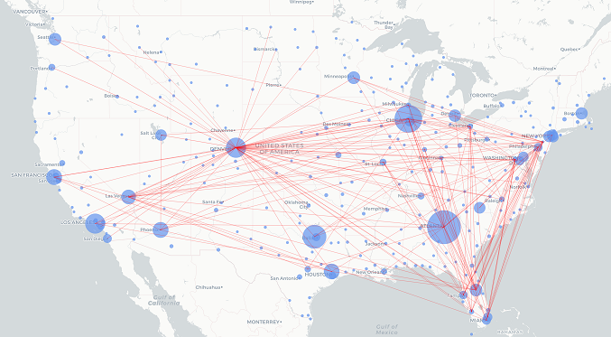

```{r setup, include=FALSE}
library(ggplot2)
library(dplyr)
library(kableExtra)
knitr::opts_chunk$set(echo = FALSE)
```

## Aggregated dataframes

We created aggregated dataframes with the data we need
```{r, echo=TRUE}
aggDF <- read.csv(
  "data/french-sncf-trains-regularities/agg_byYearStation.csv")
aggDF %>% select(year, station, num_carried_out) %>% head(n=5)
```

## Types of aggregations

We grouped every aggregation in one of the following:  
- **Total aggregations** (total number of something)  
- **Average aggregations** (average number of something)  
- **Proportion aggregations** (% of something)  
  
Each aggregation can be shown per station, per year for a specific station, or per year for every stations.

## Total aggregations

Example: aggregations per year of carried out trains, for "Aix en Provence"
```{r, echo=FALSE}
theme_set(theme_minimal() + theme(axis.title.y=element_blank()))
```
```{r trains_totalPlot, echo=FALSE}
ggplot(aggDF %>% filter(station == "AIX EN PROVENCE TGV"),
       aes(x=year, y=num_carried_out, fill=as.factor(year))) + 
  geom_col() + scale_fill_brewer(palette="Blues") + 
  geom_label(aes(label=num_carried_out)) + guides(fill="none")

```

## Average aggregations

Example: aggregation per station of average delay (min) of late trains in 2015

```{r trains_averagePlot, echo=FALSE}
ggplot(aggDF %>% filter(year == 2015),
       aes(x=station, y=avg_delay_late_on_arrival, fill=as.factor(station))) +
        geom_col() + 
        guides(fill="none") + 
        theme_minimal() + 
        theme(axis.text.x=element_text(size = 10, angle = -90, hjust = 0),
              axis.title.x=element_blank(), axis.title.y=element_blank()) +
        labs(title="Average delay on arrival of late trains per station (min)")
```

## Proportion aggregations

Example of proportion of delays causes per year, for "Aix en Provence"  
  
```{r trains_proportionPlot, echo=FALSE}
delays_melted <- read.csv("data/french-sncf-trains-regularities/delays_melted_byYearStation.csv", check.names=FALSE, encoding="UTF-8") %>% 
  filter(station == "AIX EN PROVENCE TGV")
ggplot(delays_melted,
                      aes(x=year, y=proportion, fill=delay_cause)) +
        geom_col(position="fill") + 
        theme_minimal() + 
        theme(axis.text.x=element_text(angle=45, vjust=2.6, hjust=1.5), axis.title.x=element_blank()) + 
        guides(fill=guide_legend(title="Delay causes")) + 
        labs(y="Proportion of delay causes per year (%)")
```

## Airports

Example of network map for "Frontier Airlines"


## Aggregations per airlines

```{r, echo=FALSE}
bd_airports <- read.csv("data/usa-flight-delays/airports.csv", header = TRUE)
bd_airlines <- read.csv("data/usa-flight-delays/airlines.csv", header = TRUE)
bd_flights <- read.csv("data/usa-flight-delays/flights_complete_agg.csv", header = TRUE)
bd_airlines$Flight_Count <- aggregate(bd_flights$s.COUNT, by=list(Category=bd_flights$AIRLINE), FUN=sum)$x
bd_airlines$Average_Arrival_Delay <- aggregate(bd_flights$s.ARRIVAL_DELAY, by=list(Category=bd_flights$AIRLINE), FUN=sum)$x / bd_airlines$Flight_Count
theme_set(theme_minimal())
ggplot(bd_airlines, aes(x=IATA_CODE, y=Average_Arrival_Delay, 
    fill=as.factor(IATA_CODE))) + geom_bar(stat="identity") + 
  labs(x="Airlines codes", y="Average delay on arrival") +
  guides(fill="none")

```

## Aggregations per airport
```{r, echo=FALSE}
bd_airports$Delayed_Count <- aggregate(bd_flights$s.DELAYED, by=list(Category=bd_flights$ORIGIN_AIRPORT), FUN=sum)$x
barplot(bd_airports[order(bd_airports$Delayed_Count, decreasing=TRUE),]$Delayed_Count[1:30],
                                                      names.arg = bd_airports[order(bd_airports$Delayed_Count, decreasing=TRUE),]$IATA_CODE[1:30], las=2)
```

## Useful links
- [GitHub Repository](https://github.com/gaelcharles/RShiny-ECE-project)  
- [Shiny app](https://charles-zmerli-coste.shinyapps.io/r_project/)  
- [R Presentation](http://rpubs.com/gaelcharles/RShiny-Presentation)  