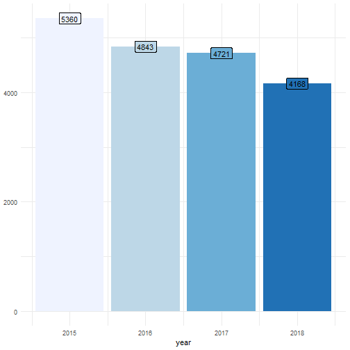
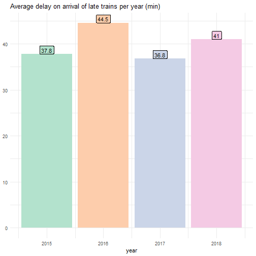
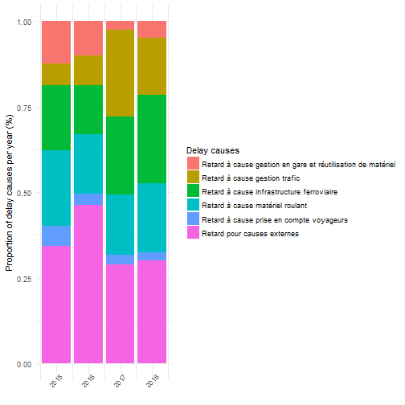

R Shiny trains and flights dashboard
========================================================
author: Gaël CHARLES, Corentin COSTE, Ismail ZMERLI
date: 19/12/2019
autosize: true

Aggregated dataframes
========================================================

We created aggregated dataframes with the data we need


```r
aggDF <- read.csv("data/french-sncf-trains-regularities/agg_byYearStation.csv")
aggDF %>% select(year, station, num_carried_out) %>% head(n=5)
```

```
  year             station num_carried_out
1 2015 AIX EN PROVENCE TGV            5360
2 2015   ANGERS SAINT LAUD            5418
3 2015           ANGOULEME            4112
4 2015              ANNECY            2171
5 2015               ARRAS            3911
```

Types of aggregations
========================================================
We grouped every aggregation in one of the following:
- **Total aggregations** (total number of something)
- **Average aggregations** (average number of something)
- **Proportion aggregations** (% of something)
  
Each aggregation can be shown per station, per year for a specific station, or per year for every stations.

Total aggregations
========================================================

Example: aggregations per year of carried out trains, for "Aix en Provence"


```r
ggplot(aggDF %>% filter(station == "AIX EN PROVENCE TGV"),
       aes(x=year, y=num_carried_out, fill=as.factor(year))) + 
  geom_col() + scale_fill_brewer(palette="Blues") + 
  geom_label(aes(label=num_carried_out)) + guides(fill="none")
```




Average aggregations
========================================================

By following the same structure we can plot aggregations by average.  
Example: aggregation per year of average delay (min) of late trains, for "Aix en Provence"



Proportion aggregations
========================================================

By following the same structure we can plot aggregations by propotions  
Example of proportion of delays causes per year, for "Aix en Provence"


